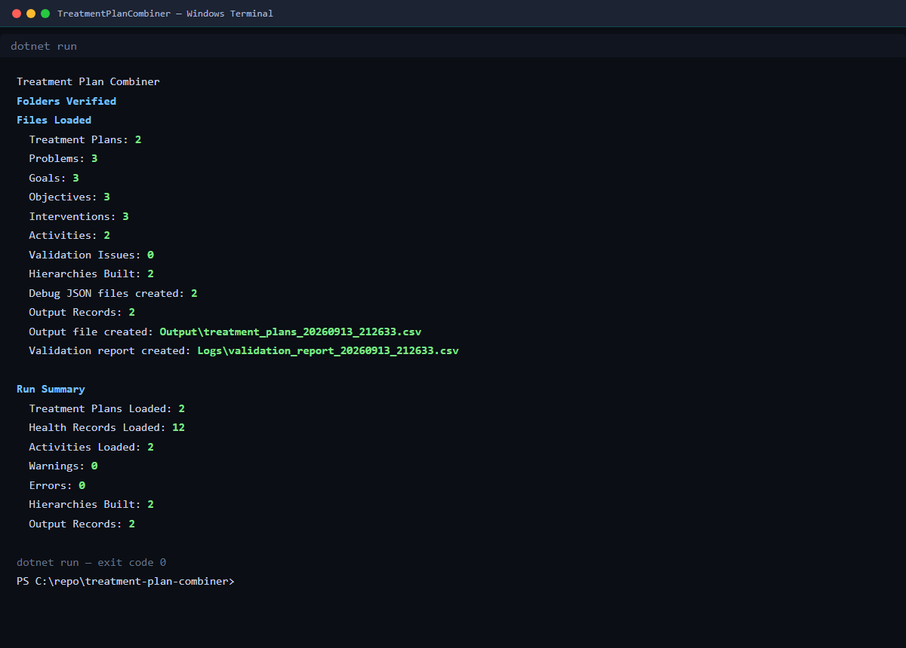
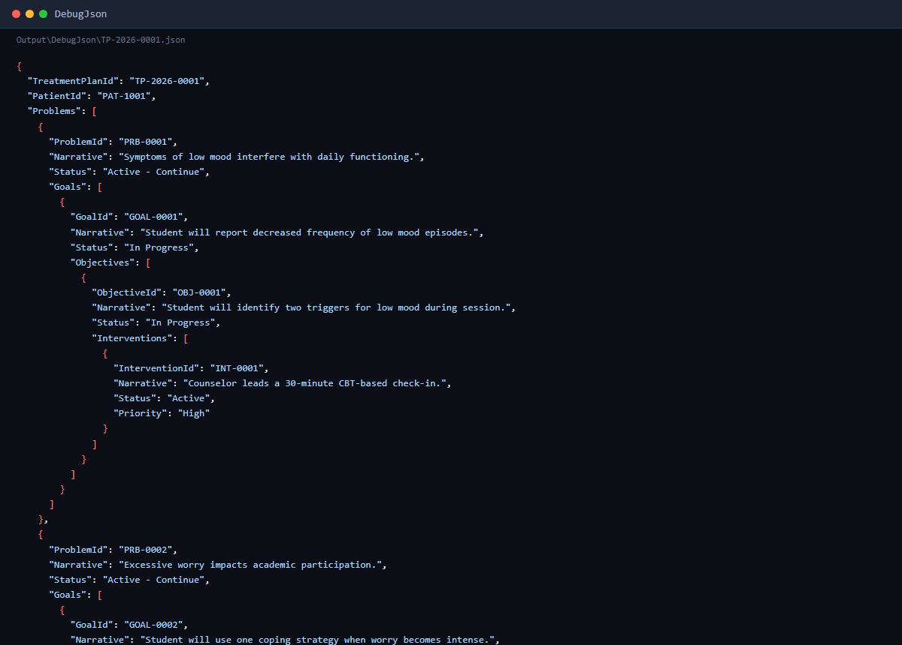
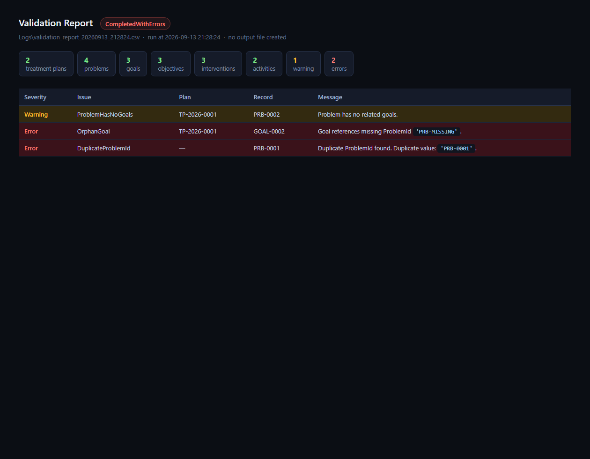
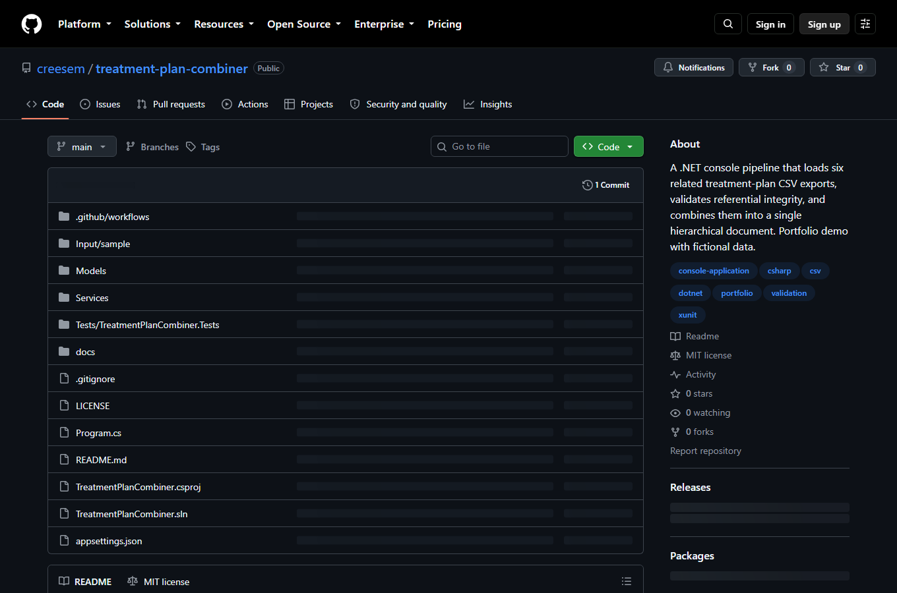

# Treatment Plan Combiner — screenshots

All screenshots below were captured from **real** pipeline runs on the sample dataset
shipped in `Input/sample/`. No content was fabricated.

---

## 1. Successful console run

Shows the per-file load counts, validation pass, hierarchy build counts, and the final
output file paths. Exit code 0.

---

## 2. Treatment-plan hierarchy (debug JSON)

The per-plan debug JSON (`Output\DebugJson\TP-2026-0001.json`) shows the full
Plan → Problem → Goal → Objective → Intervention hierarchy emitted by the pipeline.

---

## 3. Validation report — missing relationship + duplicate

The validation report CSV renders when the pipeline detects blocking errors.
This run includes:

- **OrphanGoal** — a goal references a `Problem Id` that does not exist
  (`PRB-MISSING`).
- **DuplicateProblemId** — the same problem identifier appears twice
  (`PRB-0001`).

Errors block the output file; warnings do not.

---

## 4. Public repository

The repository is public on GitHub:

**https://github.com/creesem/treatment-plan-combiner**

